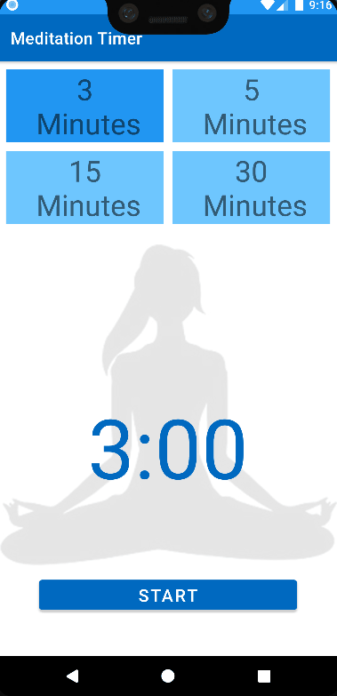

# Meditation Timer App

## Requirements
- Android Studio Bumblebee or later

## Tech Stack
- [View Model](https://vtsen.hashnode.dev/recommended-ways-to-create-viewmodel-or-androidviewmodel) & Live Data
- [Recycle View](https://vtsen.hashnode.dev/step-by-step-guides-to-implement-recycleview) (Grid Layout Manager)
- Vibration and Media Player
- Work Manager (Foreground Service and Notification)

## Main Issues
### Doze and App Standby mode (API Level 23 onwards) 
- Have attempted the following but no luck
   - WAKE_LOCK
   - REQUEST_IGNORE_BATTERY_OPTIMIZATION
   - ACTION_IGNORE_BATTERY_OPTIMIZATION_SETTINGS
- Workaround is to turn on "Allow background activity" for this app

>In theory, foreground service should prevent phone goes into sleep.  It works on my emulator (with ADB doze mode command), but not on my actual phone. So, I have no clue now.

